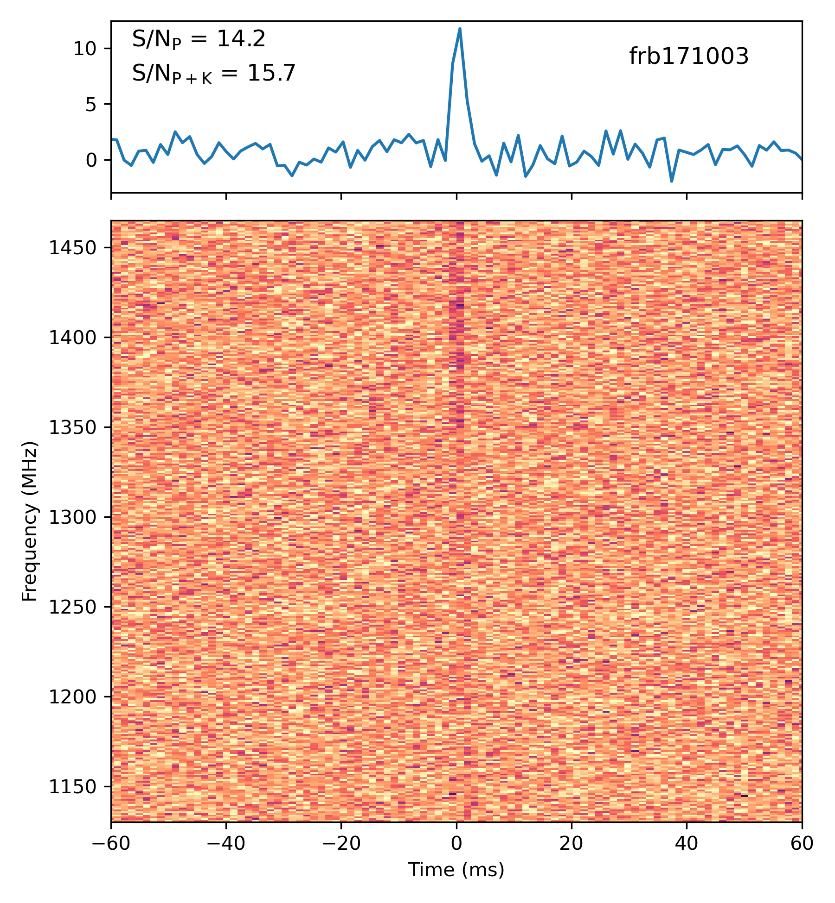
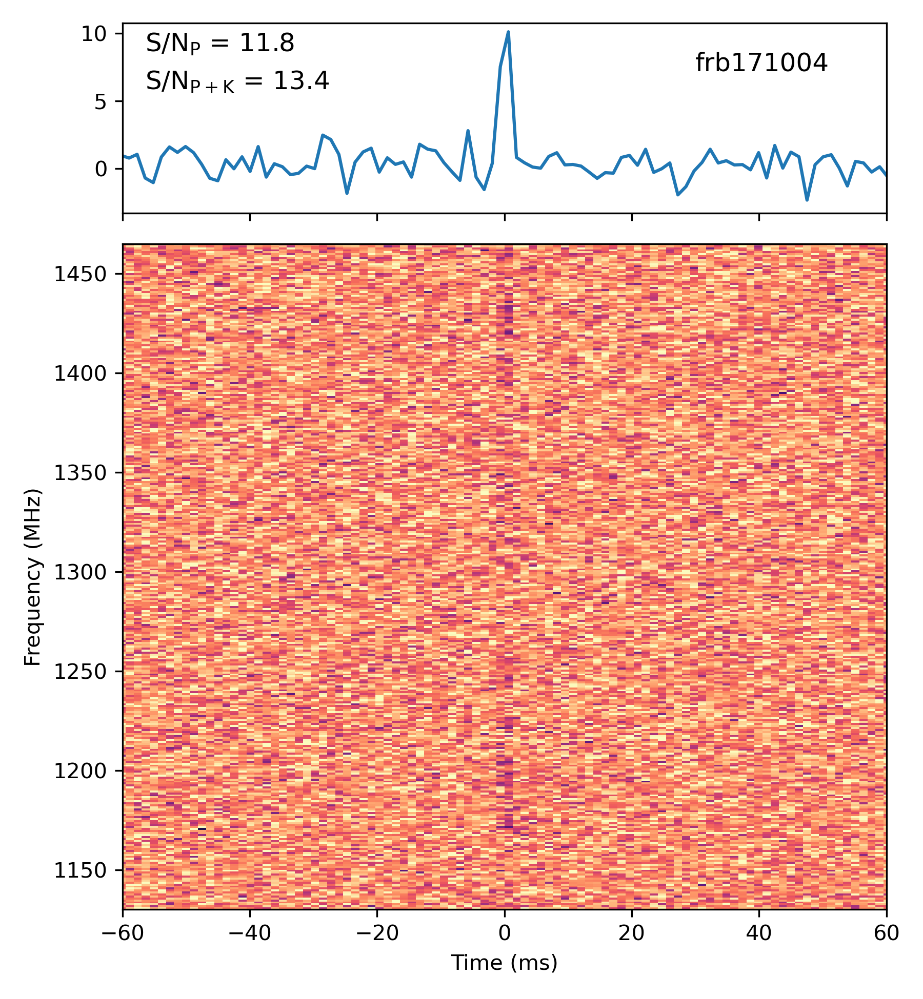

# kalman_detector

[](https://github.com/pravirkr/kalman_detector/actions/workflows/ci.yml)
[](https://codecov.io/gh/pravirkr/kalman_detector)
[](https://github.com/pravirkr/kalman_detector/blob/main/LICENSE)
[](https://github.com/psf/black)

A Python Implementation of a Kalman filter detector for detecting smoothly variying signals hidden in gaussian noise, such as Fast Radio Bursts (FRBs).

The detection statistic is designed to process `I(f)`, a sequence of observed "amplitudes" (where `f` is an arbitrary indexed parameter), and decide between the following hypotheses:

```markdown
H0: I(f) = N(f)         Pure gaussian noise
H1: I(f) = A(f) + N(f)  A(f) is a smooth gaussian process with an unknown smoothness parameter. 
```

## Installation

The quickest way to install the package is to use [pip](https://pip.pypa.io):

```bash
pip install -U kalman_detector
```

## Usage

```python
from kalman_detector.main import KalmanDetector

kalman = KalmanDetector(spectrum_std)
kalman.prepare_fits(ntrials=10000)
kalman.get_significance(spectrum)
```

### Example

An example script demonstrating how to use the Kalman detector can be found in the [examples](examples/frb_kalman.py) directory.

|           |           |
| --------- | --------- |
|  |  |

### Efficiency

An example efficiency plot can be generates using:

```python
python -m kalman_detector.efficiency
```

## Citation

Please cite [Kumar, Zackay & Law (2024)](https://ui.adsabs.harvard.edu/abs/2024ApJ...960..128K) if you find this code useful in your research.
The BibTeX entry for the paper is:

```bash
@ARTICLE{2024ApJ...960..128K,
       author = {{Kumar}, Pravir and {Zackay}, Barak and {Law}, Casey J.},
        title = "{Detecting Fast Radio Bursts with Spectral Structure Using the Continuous Forward Algorithm}",
      journal = {\apj},
     keywords = {Radio astronomy, Radio transient sources, Astronomy data analysis, Astrostatistics techniques, Interstellar scintillation, 1338, 2008, 1858, 1886, 855, Astrophysics - High Energy Astrophysical Phenomena, Astrophysics - Instrumentation and Methods for Astrophysics},
         year = 2024,
        month = jan,
       volume = {960},
       number = {2},
          eid = {128},
        pages = {128},
          doi = {10.3847/1538-4357/ad0964},
archivePrefix = {arXiv},
       eprint = {2306.07914},
 primaryClass = {astro-ph.HE},
       adsurl = {https://ui.adsabs.harvard.edu/abs/2024ApJ...960..128K},
      adsnote = {Provided by the SAO/NASA Astrophysics Data System}
}
```
